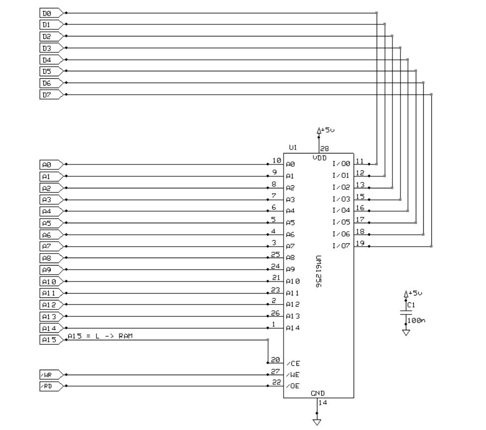

# *32KB SRAM* Card
32KByte Static-RAM with address in 0000H - 7FFFH.

## Schematic

## PCB Layout

## Bill of Materials
- [x] paperboard 
- [x] DIL 40-pin right-angle header
- [x] IC-Socket DIL 28-pin
- [x] IC SRAM UM61256P
- [x] bulk capacitor 100nF 16V